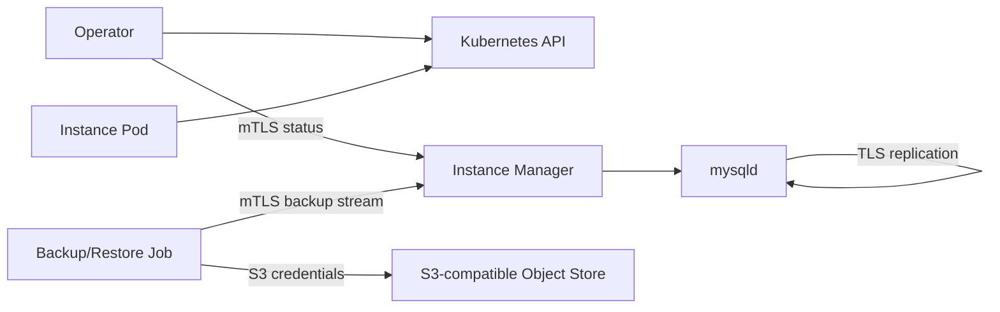

# Security model

CNMySQL separates control-plane access, MySQL traffic, replication traffic, and
object-store credentials. The design goal is to keep long-lived database Pods
focused on database operation while short-lived Jobs and init containers handle
backup and restore data movement.

## Trust boundaries



## Operator to instance manager

The operator talks to the instance manager over HTTPS with mutual TLS. The
instance manager verifies the client certificate against the cluster client CA.
The operator verifies the instance manager certificate against the cluster CA.

This channel is used for:

- status collection during reconciliation/resync;
- backup streaming from an instance;
- legacy or helper control operations where still present.

The current dynamic-role design keeps primary policy in the operator and lets
the instance manager converge locally from Cluster status.

## MySQL transport TLS

CNMySQL renders MySQL TLS configuration:

- `ssl_ca`
- `ssl_cert`
- `ssl_key`

Replication uses TLS material and a replication account that requires X509.

Application TLS enforcement is a user choice. CNMySQL does not force
`require_secure_transport` by default. To require encrypted application
connections:

```yaml
spec:
  mysql:
    parameters:
      require_secure_transport: "ON"
```

## Certificates

The current implementation depends on cert-manager for generated cluster
certificates. The operator reconciles issuers/certificates and waits for the
resulting Secrets before creating Pods that need them.

User-managed TLS certificates are planned but not fully wired yet. Until that
milestone lands, treat operator-generated cert-manager material as the supported
path.

## Database accounts

CNMySQL manages internal accounts for:

- root/bootstrap;
- application owner and database;
- replication;
- instance-manager control;
- backup.

The backup account is dedicated to XtraBackup and receives only the privileges
needed for physical backup on the target Percona version. On modern versions
that includes `BACKUP_ADMIN`; older versions use the compatible static grants.

Generated Secrets are not overwritten when the user provides their own
credentials. Recovery currently reconciles internal account passwords to the
recovery cluster Secrets after restore.

## Kubernetes RBAC

The operator owns the broad reconciliation permissions for Clusters, Backups,
ScheduledBackups, Jobs, Pods, Secrets, Services, PVCs, and cert-manager
resources.

Each Cluster also gets an instance ServiceAccount for the in-pod role
reconciler. That account is scoped to the owning Cluster and needs:

- `get`, `list`, `watch` on the Cluster;
- `get`, `update`, `patch` on the Cluster status;
- related read access needed by in-pod management controllers.

This lets an instance self-promote or self-follow by updating status only when
it is the correct target.

## Object-store credentials

One-shot backup workers receive object-store credentials as environment
variables sourced from Kubernetes Secrets. The controller-manager does not
stream backup payload bytes.

Continuous archiving is different: the primary instance manager writes binlog
segments to the object store, so instance Pods need the archive destination and
credentials when archiving is enabled.

Credentials may be static Secret references or inherited from IAM-style
workload identity depending on the object-store configuration.

## Sensitive data in logs

Operator and instance-manager logs should be structured. Child process output is
wrapped into structured log records with stream and process context.

Backup/archive payload streams are data paths, not logs. Commands that emit
backup bytes on stdout must only wrap stderr into structured logs.

Object-store credentials, signed URLs, passwords, and TLS private keys must not
be logged or copied into status.

## Current limits and follow-ups

- User-managed TLS certificate bring-your-own-secret support is a future
  milestone.
- A CNPG-parity audit is planned for instance status collection and failover
  safety: temporary manager status failures must not trigger unsafe failover by
  themselves.
- Backup object deletion through a finalizer is not implemented and should be
  opt-in or guarded.
- NetworkPolicy examples are not shipped yet.
